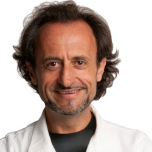
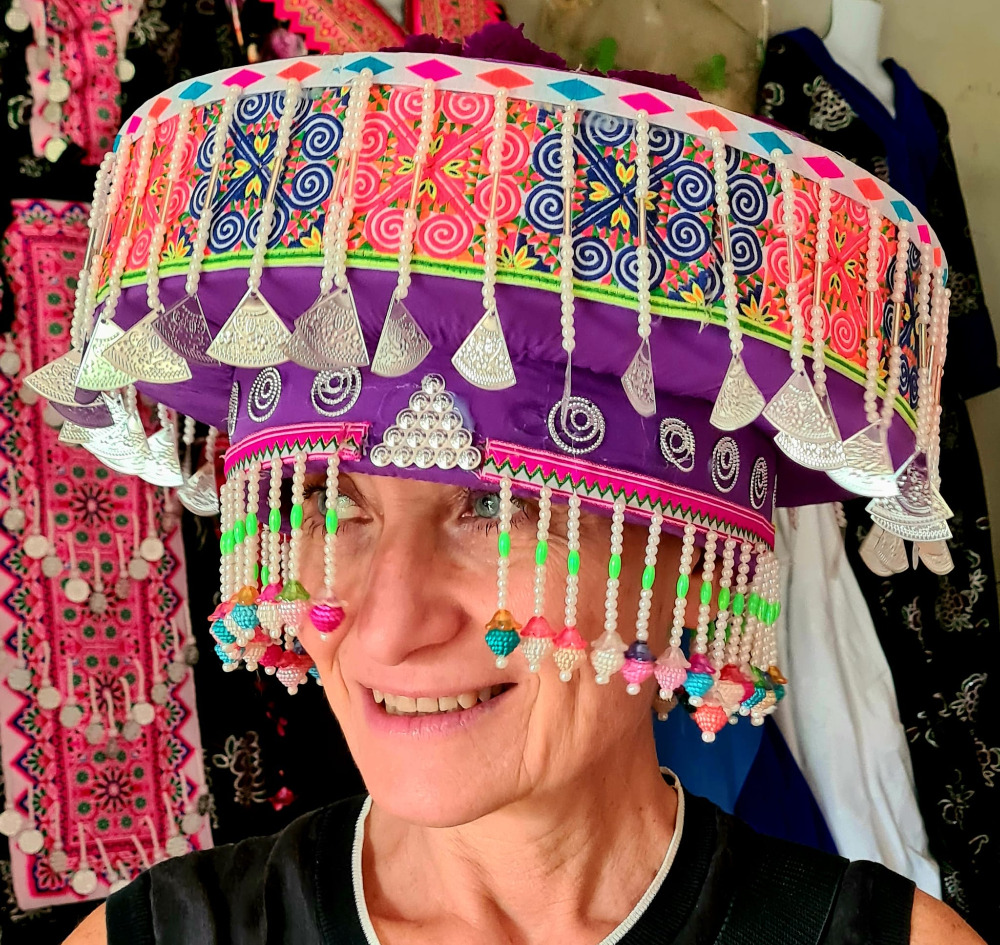

[![Contributors][contributors-shield]][contributors-url]
[![Forks][forks-shield]][forks-url]
[![Stargazers][stars-shield]][stars-url]
[![Issues][issues-shield]][issues-url]
[![MIT License][license-shield]][license-url]
[![LinkedIn][linkedin-shield]][linkedin-url]


<!-- PROJECT LOGO -->
<br />
<p align="center">
  <a href="">
  <h3 align="center"> Scita Lab </h3>
  </a>
  <p align="center">
    Mechanisms of Tumor Cell Migration Building 2, Floor 1, lab A
  </p>
</p>

<!-- TABLE OF CONTENTS -->
<details open="open">
  <summary>Table of Contents</summary>
  <ol>
  <li>
      <a href="#about-the-lab">About the lab</a>
  </li>
  <li>
      <a href="#people">People</a>
  </li>
    <li>
      <a href="#pipelines">Pipelines</a>
    </li>
    <li>
      <a href="#scripts">Scripts</a>
    </li>
    <li>
      <a href="#publications">Scripts</a>
    </li>
    <li><a href="#contact">Contact</a></li>
  </ol>
</details>


<!-- ABOUT THE LAB -->
## About The Lab

The main focus of our team is 

* What are the molecular and physical mechanisms controlling tissue fluidification in epithelial cells and breast tumor models of DCIS?

* How the mechanical perturbations associated with unjamming by impacting the acquisition of heritable changes influence cell phenotypes, fate, and tumor ecology (tumor cell interaction with immune cells). We will specifically focus on unexpected cellular processes and molecular mechanisms underlying tissue fluidification-dependent genetic rewiring toward a cGAS-STING-mediated innate immunity response by studying the role of mitochondria dynamics, morphology, and integrity during unjamming-via-flocking.

* What are the pathobiological consequence of tissue fluidification by determining whether tissue fluidization can turn immunological cold lesions into hot ones using syngeneic mice models and human specimens


<!-- people -->
## People
<ul>
  <li> <a href="https://www.ifom.eu/en/cancer-research/researchers/giorgio-scita.php">Giorgio Scita</a> </p>
<p align="center">
 </p> 
</p> 
A cell biologist and expert on the dynamics of cell movement, Giorgio Scita directs the Mechanisms of Tumor Cell Migration research unit at IFOM.
Born in 1963 near Parma, Scita enrolled in the Faculty of Biology at the University of Parma in 1982 with a precise intention: to study animal behavior alongside the famous Italian ethologist Danilo Mainardi.
</p>
</li>
  <li><a href="andrea.palamidessi@ifom.eu">Andrea Disanza</a>  <p align="center">
 </p>  Bio Andrea P. </p>
</p>
</li>
  <li><a href="emanuela.frittoli@ifom.eu">Emanuela Frittoli</a> <p align="center">
 </p> Bio Emy F </p>
</p> 
  </li>
  <li><a href="andrea.disanza@ifom.eu">Andrea Disanza</a>  <p align="center">
 </p> Bio Andrea D. </p>
</p>
</li>
  <li> <a href="monica.corada@ifom.eu">Monica Corada</a> <p align="center">
 </p> Bio Monica  </p>
</p>
</li>
  <li> <a href="stefano.marchesi@ifom.eu">Stefano Marchesi </a> <p align="center">
 </p> Bio stefano </p>
</p>  
</li>
  <li> <a href="hind.abdo@ifom.eu">Hind Abdo </a> <p align="center">
 </p> Bio Hind </p>  
</p>  
</li>
  <li> <a href="hind.abdo@ifom.eu">Hind Abdo </a> <p align="center">
 </p> Bio Hind </p>
</p>  
</li>
  </ul>


<!-- Pipelines -->
## Pipelines
In pipeline folder are present all our lab piplines in snakemake. Within every folder are present:
* `.sk` file, that contain all rules sequence.
 ```bash 
 head pipeline/Chip_seq/Chipseq.sk

 # lib
from snakemake.io import glob_wildcards, expand
import glob,os
import pathlib
import pandas as pd
#import multiqc

#config
configfile: "config_ATAC_2.yaml"
```

* `.yaml` file, that must be edit according to organism and statistics and user needs.
 ```bash 
 cat pipeline/Chip_seq/config.yaml

# proj parameters
Project: "prova_chip_seq"
skipH: 6
RAWDATA: "/beegfs/scratch/ric.broccoli/ric.broccoli/prova_chip_seq"
RUN_ID: "prova_chip_seq" # "RUN_id"
# genome
genome: "hg38"
ref_genome_fa: "/beegfs/scratch/ric.broccoli/ric.broccoli/Genomes/hg38/fa/hg38.fa"
chrom_sizes: "/beegfs/scratch/ric.broccoli/ric.broccoli/Genomes/hg38/hg38.chrom.sizes"
# trimming
adapters: "/beegfs/scratch/ric.broccoli/ric.broccoli/adapters/NexteraPE-PE.fa"
# blacklist
blacklist_url: "http://mitra.stanford.edu/kundaje/akundaje/release/blacklists/hg38-human/hg38.blacklist.bed.gz"
# peaks
genome_size_bp: 3209286105
peaks_qvalue: 0.01
broad_cut_off: 0.001
```
* `.csv` file conteins all information abount the metadata of the samples such as sample condition, or whatever you need to specify.
 ```bash
cat pipeline/Chip_seq/samplesheet.csv

[Header],,,,,,,,,,,
IEMFileVersion,4,,,,,,,,,,
Date,2019-06-07 08:32:36+00:00,,,,,,,,,,
,,,,,,,,,,,
[Reads],,,,,,,,,,,
,,,,,,,,,,,
,,,,,,,,,,,
[Settings],,,,,,,,,,,
,,,,,,,,,,,
[Data],,,,,,,,,,,
Lane,Sample_ID,Sample_Name,Sample_Plate,Sample_Well,I7_Index_ID,index,I5_Index_ID,index2,Sample_Project,Description,Container_Label
,CtrlH3K27acChIP-Seq2_S189_R1_001.fastq.gz,CtrlH3K27acChIP-Seq2_S189_R1_001.fastq.gz,,,UDI0073,CAATTAAC,UDI0073,CGAGATAT,prova_chip_seq,,
,CtrlH3K27acChIP-Seq2_S189_R2_001.fastq.gz,CtrlH3K27acChIP-Seq2_S189_R2_001.fastq.gz,,,UDI0073,CAATTAAC,UDI0073,CGAGATAT,prova_chip_seq,,
,InputCtrlChIP-Seqs_S182_R1_001.fastq.gz,InputCtrlChIP-Seqs_S182_R1_001.fastq.gz,,,UDI0073,CAATTAAC,UDI0073,CGAGATAT,prova_chip_seq,,
,InputCtrlChIP-Seqs_S182_R2_001.fastq.gz,InputCtrlChIP-Seqs_S182_R2_001.fastq.gz,,,UDI0073,CAATTAAC,UDI0073,CGAGATAT,prova_chip_seq,,
 ```

<!-- SCRIPTS -->
## Scripts
In scripts folder are present stand alone script used generally to perform downstream analisys like scRNA-seq clustering, Bulk RNA-seq, or custom plot.


<!-- PUBLICATIONS -->
## Publications

<!-- CONTACT -->
## Contacts


Edoardo Bellini - <bellini.edoardo@hsr.it>

Mattia Zaghi - <zaghi.mattia@hsr.it>

Alessandro Sessa - <sessa.alessandro@hsr.it>

<!-- MARKDOWN LINKS & IMAGES -->
<!-- https://www.markdownguide.org/basic-syntax/#reference-style-links -->
[contributors-shield]: https://img.shields.io/github/contributors/othneildrew/Best-README-Template.svg?style=for-the-badge
[contributors-url]: https://github.com/othneildrew/Best-README-Template/graphs/contributors
[forks-shield]: https://img.shields.io/github/forks/othneildrew/Best-README-Template.svg?style=for-the-badge
[forks-url]: https://github.com/othneildrew/Best-README-Template/network/members
[stars-shield]: https://img.shields.io/github/stars/othneildrew/Best-README-Template.svg?style=for-the-badge
[stars-url]: https://github.com/othneildrew/Best-README-Template/stargazers
[issues-shield]: https://img.shields.io/github/issues/othneildrew/Best-README-Template.svg?style=for-the-badge
[issues-url]: https://github.com/othneildrew/Best-README-Template/issues
[license-shield]: https://img.shields.io/github/license/othneildrew/Best-README-Template.svg?style=for-the-badge
[license-url]: https://github.com/othneildrew/Best-README-Template/blob/master/LICENSE.txt
[linkedin-shield]: https://img.shields.io/badge/-LinkedIn-black.svg?style=for-the-badge&logo=linkedin&colorB=555
[linkedin-url]: https://linkedin.com/in/othneildrew
[product-screenshot]: images/screenshot.png
