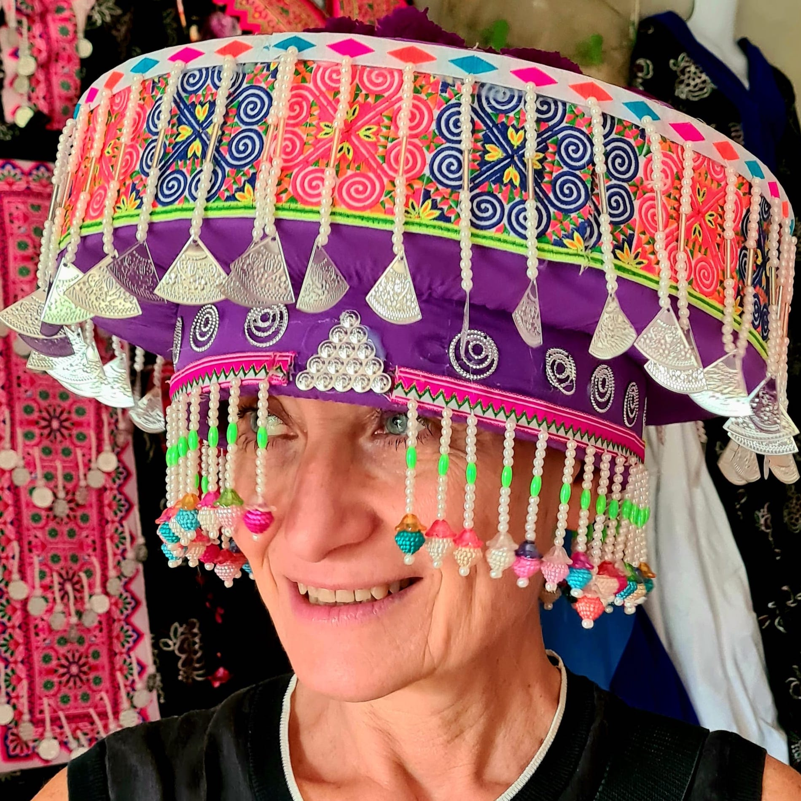

[![Contributors][contributors-shield]][contributors-url]
[![Forks][forks-shield]][forks-url]
[![Stargazers][stars-shield]][stars-url]
[![Issues][issues-shield]][issues-url]
[![MIT License][license-shield]][license-url]
[![LinkedIn][linkedin-shield]][linkedin-url]


<!-- PROJECT LOGO -->
<br />
<p align="center">
  <a href="">
  <h3 align="center"> <a href="https://www.ifom.eu/it/ricerca-cancro/ricerca-lab/ricerca-lab-scita.php">Scita Lab</a> </h3>
  </a>
  <p align="center">
    Mechanisms of Tumor Cell Migration Building 2, Floor 1, lab A
  </p>
</p>

<!-- TABLE OF CONTENTS -->
<details open="open">
  <summary>Table of Contents</summary>
  <ol>
  <li>
      <a href="#about-the-lab">About the lab</a>
  </li>
  <li>
      <a href="#people">People</a>
  </li>
    <li>
      <a href="#pipelines">Pipelines</a>
    </li>
    <li>
      <a href="#scripts">Scripts</a>
    </li>
    <li>
      <a href="#publications">Scripts</a>
    </li>
    <li><a href="#contact">Contact</a></li>
  </ol>
</details>


<!-- ABOUT THE LAB -->
## About The Lab

The main focus of our team is 

* What are the molecular and physical mechanisms controlling tissue fluidification in epithelial cells and breast tumor models of DCIS?

* How the mechanical perturbations associated with unjamming by impacting the acquisition of heritable changes influence cell phenotypes, fate, and tumor ecology (tumor cell interaction with immune cells). We will specifically focus on unexpected cellular processes and molecular mechanisms underlying tissue fluidification-dependent genetic rewiring toward a cGAS-STING-mediated innate immunity response by studying the role of mitochondria dynamics, morphology, and integrity during unjamming-via-flocking.

* What are the pathobiological consequence of tissue fluidification by determining whether tissue fluidization can turn immunological cold lesions into hot ones using syngeneic mice models and human specimens


<!-- people -->
## People

<p align="center">
 </p> 
<details><summary><a href="https://www.ifom.eu/en/cancer-research/researchers/giorgio-scita.php">Giorgio Scita</a> </summary>
</p align="justified"> 
A cell biologist and expert on the dynamics of cell movement, Giorgio Scita directs the Mechanisms of Tumor Cell Migration research unit at IFOM.
Born in 1963 near Parma, Scita enrolled in the Faculty of Biology at the University of Parma in 1982 with a precise intention: to study animal behavior alongside the famous Italian ethologist Danilo Mainardi.
</p>
</details>


<p align="center">
  </p>
<details><summary><a href="andrea.palamidessi@ifom.eu">Andrea Palamidessi</a>
</summary>
</p align="justified"> 
Bio Andrea P.
</p>
</details>

<p align="center">
  </p>
<details><summary><a href="emanuela.frittoli@ifom.eu">Emanuela Frittoli</a>
</summary>
</p align="justified"> 
Bio Emy P.
</p>
</details>


<p align="center">
  </p>
<details><summary><a href="andrea.disanza@ifom.eu">Andrea Disanza</a>
</summary>
</p align="justified"> 
My name is Andrea Disanza and I am a Cellular and Molecular Biologist. I earned my degree in Biological Sciences at “Università degli Studi di Milano” and my PhD in partnership with the Open University, London, UK, carrying out my research project at the European Institute of Oncology (IEO) and at IFOM ETS, Milan, Italy, under the supervision of Prof. Giorgio Scita and Prof. Pier Paolo di Fiore and at the LEBS, CNRS, Gif-sur-Yvette, France under the supervision of Dr. Marie France Carlier. I completed my scientific training with a two years Post Doc. Since 2008 I hold the position of Staff Scientist in the laboratory of Prof. Giorgio Scita “Mechanism of tumor cell migration” and the position of Teaching Assistant in General Patology at “Università degli Studi di Milano”, Dipartimento Scienze della Saute, Milan, Italy. My research experience ranges across several subjects: molecular biology, cell biology and biochemistry, biochemistry and actin biochemistry, ex vivo and in vivo mouse models and microscopy (Wide Field/Confocal/TIRF). My studies are focused on the interplay between membrane and actin dynamics in the control of migratory and invasive strategies in cancer with an insight in the role of the I-BAR containing protein IRSp53.
</p>
</details>


<p align="center">
  </p>
<details><summary><a href="monica.corada@ifom.eu">Monica Corada</a>
</summary>
</p align="justified"> 
Bio Monica C.
</p>
</details>

<p align="center">
  </p>
<details><summary><a href="stefano.marchesi@ifom.eu">Stefano Marchesi</a>
</summary>
</p align="justified"> 
Bio Stefano M.
</p>
</details>

<p align="center">
  </p>
<details><summary><a href="hind.abdo@ifom.eu">Hind Abdo</a>
</summary>
</p align="justified"> 
Bio Hind.
</p>
</details>


<p align="center">
  </p>
<details><summary><a href="brenda.green@ifom.eu">Brenda Green</a>
</summary>
</p align="justified"> 
Bio Brenda.
</p>
</details>

<p align="center">
  </p>
<details><summary><a href="edoardo.bellini@ifom.eu">Edoardo Bellini</a>
</summary>
</p align="justified"> 
Edoardo Bellini is a computational biologist and Bioinformatician working on basic research in the lab, and in the Bioinformatics Core of the <a href="https://www.ifom.eu/en/">IFOM </a> institute. His work is focused on all NGS data type coming from breast cancer disease models. He earned a Master Degree in Biology in 2018 at the University of Milano Bicocca and a Master in Bioinformatics and Functional Genomics in 2020 at University of Milan and INGM. He has gained previous research experiences as Bioinformatician at the San Raffaele Hospital analizyng all type of omics data and also as Computational Biologist as <a href="https://www.r-project.org/">R </a> package developer.
</p>
</details>


<p align="center">

<details><summary><a href="emanuele.martini@ifom.eu">Emanuele Martini </a> </summary>
 </p> Bioimaging and biological data analysis specialist with 10 years of experience in developing analysis routines and workflows to extract meaningful biological knowledge from images and biological data, ML/AI included.  </p>
</details>


<p align="center">

<details><summary><a href="leonardo.barzaghi@ifom.eu">Leonardo Barzaghi </a> </summary>
 </p> Leonardo Barzaghi earned his Bachelor's degree in Medical Biotechnology and later completed his Master's degree in Molecular Biotechnology and Bioinformatics at Università degli Studi di Milano. During his Master's program, he joined the research team led by Giorgio Scita, exploring the role of RAB5A protein family members in collective motility within epithelial cell monolayers. Intrigued by the multidisciplinary approaches used in his lab, Leonardo chose to continue his academic journey under the mentorship of Giorgio Scita, pursuing a Ph.D. in Molecular Oncology at SEMM. Now in his fourth year, Leonardo's research focus is at the intersection of cell biology and biophysics. He is specifically investigating the complex role of mechanical heterogeneity in breast cancer invasion, utilising 2D and 3D in vitro models. Leonardo's expertise includes live cell imaging and image analysis, with a particular emphasis on characterising collective cell motility at a biophysical level.  </p>
</details>

<p align="center">

<details><summary><a href="camillo.mazzella@ifom.eu">Camillo Mazzella </a> </summary>
 </p> Hi, I'Camillo Mazzella. I started as an engineer with a master’s degree in Industrial Bioengineering  Naples Federico II. 
Because I am interested in the oncology field, I completed a traineeship at ANGLE plc to model microfluidic devices for liquid biopsy. Then, I focused my career on oncology research to have better understand tumor biology. Actually, I'm a PhD student at IFOM, to study the impact of cell motility in cancer progression, within the group of Professor Giorgio Scita.  </p>
</details>


<p align="center">

<details><summary><a href="mona.makkieh@ifom.eu">Mona Makkieh </a> </summary>
 </p> Mona Makkieh, research technician with a strong background in molecular oncology, actively contributing to cutting-edge research in Scita's group at IFOM, focusing on examining breast tumor cluster deformability as well as capturing circulating tumor cells. As an Erasmus Alumni, Mona spent a fruitful year as Student Researcher in the Department of Neuroscience at the University of Copenhagen, conducting structural studies on various G protein-coupled receptors (GPCRs) and investigating their correlation with cancer development. Regarding her educational background, Mona holds a Master's Degree in Molecular Biology and Genetics from the University of Pavia in Italy and a Bachelor's Degree in Medical Laboratory Technology from the Beirut Arab University in Lebanon. Mona's skill set is extensive and focused, covering DNA, RNA, protein, and plasmid purification, gene cloning, site-directed mutagenesis, microfluidics, spheroid assays, PCR/DNA sequencing, Southern/Western blotting, mammalian and insect cell cultures, cryo-sectioning, transfection, preparing membranes, saturation binding assay, competition binding assay, gel electrophoresis, and HPLC.  </p>
</details>


<p align="center">

<details><summary><a href="davidelazzari7@gmail.com">Mona Makkieh </a> </summary>
 </p> Bio Davide </p>
</details>


<!-- Pipelines -->
## Pipelines
In pipeline folder are present all our lab piplines in snakemake or nextflow. Within every folder are present:
* `.sk` or * `.nf` file, that contain all rules sequence.
 ```bash 
 head pipeline/Chip_seq/Chipseq.sk

 # lib
from snakemake.io import glob_wildcards, expand
import glob,os
import pathlib
import pandas as pd
#import multiqc

#config
configfile: "config_ATAC_2.yaml"
```

* `.yaml` file, that must be edit according to organism and statistics and user needs.
 ```bash 
 cat pipeline/Chip_seq/config.yaml

# proj parameters
Project: "prova_chip_seq"
skipH: 6
RAWDATA: "/beegfs/scratch/ric.broccoli/ric.broccoli/prova_chip_seq"
RUN_ID: "prova_chip_seq" # "RUN_id"
# genome
genome: "hg38"
ref_genome_fa: "/beegfs/scratch/ric.broccoli/ric.broccoli/Genomes/hg38/fa/hg38.fa"
chrom_sizes: "/beegfs/scratch/ric.broccoli/ric.broccoli/Genomes/hg38/hg38.chrom.sizes"
# trimming
adapters: "/beegfs/scratch/ric.broccoli/ric.broccoli/adapters/NexteraPE-PE.fa"
# blacklist
blacklist_url: "http://mitra.stanford.edu/kundaje/akundaje/release/blacklists/hg38-human/hg38.blacklist.bed.gz"
# peaks
genome_size_bp: 3209286105
peaks_qvalue: 0.01
broad_cut_off: 0.001
```
* `.csv` file conteins all information abount the metadata of the samples such as sample condition, or whatever you need to specify.
 ```bash
cat pipeline/Chip_seq/samplesheet.csv

[Header],,,,,,,,,,,
IEMFileVersion,4,,,,,,,,,,
Date,2019-06-07 08:32:36+00:00,,,,,,,,,,
,,,,,,,,,,,
[Reads],,,,,,,,,,,
,,,,,,,,,,,
,,,,,,,,,,,
[Settings],,,,,,,,,,,
,,,,,,,,,,,
[Data],,,,,,,,,,,
Lane,Sample_ID,Sample_Name,Sample_Plate,Sample_Well,I7_Index_ID,index,I5_Index_ID,index2,Sample_Project,Description,Container_Label
,CtrlH3K27acChIP-Seq2_S189_R1_001.fastq.gz,CtrlH3K27acChIP-Seq2_S189_R1_001.fastq.gz,,,UDI0073,CAATTAAC,UDI0073,CGAGATAT,prova_chip_seq,,
,CtrlH3K27acChIP-Seq2_S189_R2_001.fastq.gz,CtrlH3K27acChIP-Seq2_S189_R2_001.fastq.gz,,,UDI0073,CAATTAAC,UDI0073,CGAGATAT,prova_chip_seq,,
,InputCtrlChIP-Seqs_S182_R1_001.fastq.gz,InputCtrlChIP-Seqs_S182_R1_001.fastq.gz,,,UDI0073,CAATTAAC,UDI0073,CGAGATAT,prova_chip_seq,,
,InputCtrlChIP-Seqs_S182_R2_001.fastq.gz,InputCtrlChIP-Seqs_S182_R2_001.fastq.gz,,,UDI0073,CAATTAAC,UDI0073,CGAGATAT,prova_chip_seq,,
 ```

<!-- SCRIPTS -->
## Scripts
In scripts folder are present stand alone script used generally to perform downstream analisys like scRNA-seq clustering, Bulk RNA-seq, or custom plot.


<!-- PUBLICATIONS -->
## Publications

<!-- CONTACT -->
## Contacts


Edoardo Bellini - <bellini.edoardo@hsr.it>

Mattia Zaghi - <zaghi.mattia@hsr.it>

Alessandro Sessa - <sessa.alessandro@hsr.it>

<!-- MARKDOWN LINKS & IMAGES -->
<!-- https://www.markdownguide.org/basic-syntax/#reference-style-links -->
[contributors-shield]: https://img.shields.io/github/contributors/othneildrew/Best-README-Template.svg?style=for-the-badge
[contributors-url]: https://github.com/othneildrew/Best-README-Template/graphs/contributors
[forks-shield]: https://img.shields.io/github/forks/othneildrew/Best-README-Template.svg?style=for-the-badge
[forks-url]: https://github.com/othneildrew/Best-README-Template/network/members
[stars-shield]: https://img.shields.io/github/stars/othneildrew/Best-README-Template.svg?style=for-the-badge
[stars-url]: https://github.com/othneildrew/Best-README-Template/stargazers
[issues-shield]: https://img.shields.io/github/issues/othneildrew/Best-README-Template.svg?style=for-the-badge
[issues-url]: https://github.com/othneildrew/Best-README-Template/issues
[license-shield]: https://img.shields.io/github/license/othneildrew/Best-README-Template.svg?style=for-the-badge
[license-url]: https://github.com/othneildrew/Best-README-Template/blob/master/LICENSE.txt
[linkedin-shield]: https://img.shields.io/badge/-LinkedIn-black.svg?style=for-the-badge&logo=linkedin&colorB=555
[linkedin-url]: https://linkedin.com/in/othneildrew
[product-screenshot]: images/screenshot.png
